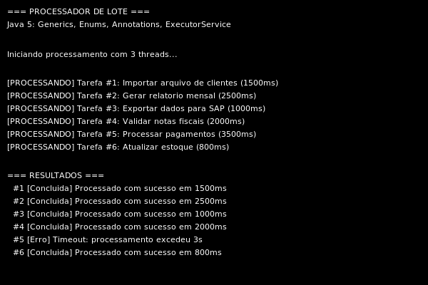

# Modulo 08 — Java 5 Generics Annotations Concurrency

> **Era:** 2004–2006 · **JDK:** 5 (Tiger) · **Paradigma:** OO tipado + concorrencia

---

## 1. Contexto historico

Em setembro de 2004, a Sun lancou o JDK 5,代号 "Tiger" — a maior atualizacao
da linguagem Java ate entao, e possivelmente a mais impactante ate hoje.
Foram introduzidos de uma so vez:

- **Generics** — `List<String>`, `Map<Integer, Produto>`
- **Enums** — `enum Status { PENDENTE, CONCLUIDO }`
- **Annotations** — `@Override`, `@SuppressWarnings`, e uso extensivo em frameworks
- **Autoboxing/unboxing** — `int` para `Integer` automaticamente
- **Enhanced for-loop** — `for (String s : lista)`
- **Varargs** — `metodo(String... args)`
- **`java.util.concurrent`** — `ExecutorService`, `Callable`, `Future`, `Lock`,
  `ConcurrentHashMap`, `CountDownLatch`, `Semaphore`
- **`StringBuilder`** — versao nao sincronizada do StringBuffer
- **`Scanner`** — leitura facilitada de entrada

## 2. Problema historico

Java pre-5 era seguro mas verboso e propenso a erros de runtime:

**Sem generics:**
```java
// 2003: qualquer coisa pode entrar na lista
List produtos = new ArrayList();
produtos.add("nao e um produto"); // compila sem erro
Produto p = (Produto) produtos.get(0); // ClassCastException em runtime!
```

**Enums como integers:**
```java
// 2003: "enum" era so um conjunto de constantes int
public static final int STATUS_PENDENTE = 1;
public static final int STATUS_CONCLUIDO = 2;
// Nao ha tipo — qualquer int pode ser passado
processar(99); // compila, mas nao faz sentido
```

**Concorrencia manual:**
```java
// 2003: gerenciar threads manualmente
new Thread(new Runnable() {
    public void run() {
        // processamento
    }
}).start();
// Sem pool, sem gerenciamento de ciclo de vida
```

## 3. Aplicacao: Processador de lote de tarefas concorrente

Um sistema que:
- Le uma lista de tarefas de processamento (simuladas com delays)
- Processa em paralelo usando `ExecutorService` com pool de threads
- Usa generics para colecoes tipadas
- Usa enum para status de processamento
- Usa `@SuppressWarnings` para controle de warnings
- Gera relatorio com `EnumMap`
- Demonstra `Callable` + `Future` para processamento assincrono

## 4. Recursos do Java 5 relevantes

| Recurso | Relevancia neste modulo |
|---------|------------------------|
| `List<Tarefa>` com generics | Elimina casts; erro em compilacao, nao runtime |
| `enum StatusTarefa` | Tipo seguro para estado; `EnumMap` para relatorios |
| `@SuppressWarnings("unchecked")` | Controle granular de warnings do compilador |
| `ExecutorService`, `Executors` | Pool de threads; submissao de tarefas |
| `Callable<Resultado>` | Tarefa que retorna valor e pode lancar excecao |
| `Future<Resultado>` | Representa resultado futuro; `get()` bloqueia |
| `for (Tarefa t : tarefas)` | Enhanced for-loop; mais legivel que index |
| `StringBuilder` | Concatenacao eficiente sem sincronizacao |
| `List<Future<Resultado>>` | Generics com tipos complexos |

## 5. Arquitetura e design

```
Main.main()
  └── ProcessadorLote.processar(List<Tarefa>, int numThreads)
        │
        ├── ExecutorService executor = Executors.newFixedThreadPool(numThreads)
        │
        ├── Para cada Tarefa:
        │     └── executor.submit(Callable<Resultado>)
        │           └── Retorna Future<Resultado>
        │
        ├── executor.shutdown()
        │
        └── Para cada Future<Resultado>:
              └── f.get() → aguarda e obtem Resultado

  └── ProcessadorLote.gerarRelatorio(List<Resultado>)
        └── EnumMap<StatusTarefa, Integer> com contagem por status
```

**Uso de generics em cada camada:**
| Local | Tipo | Beneficio |
|-------|------|-----------|
| Lista de tarefas | `List<Tarefa>` | So aceita Tarefa |
| Fila de futures | `List<Future<Resultado>>` | Future tipado com Resultado |
| Callable | `Callable<Resultado>` | Retorno tipado |
| Relatorio | `EnumMap<StatusTarefa, Integer>` | Chave tipada por enum |

## 6. Limitacoes e dificuldades

### Generics pre-8: sem inferencia

```java
// Java 5/6/7: generics verbose
List<Future<ResultadoProcessamento>> futures =
    new ArrayList<Future<ResultadoProcessamento>>();

// Java 7+: diamond operator
List<Future<Resultado>> futures = new ArrayList<>();
```

### Anonymous classes em vez de lambdas

```java
// Java 5: Callable com classe anonima
Callable<Resultado> task = new Callable<Resultado>() {
    public Resultado call() {
        return processar();
    }
};

// Java 8+: lambda
Callable<Resultado> task = () -> processar();
```

### Sem streams

Processar colecoes exigia loops explicitos `for (T : list)`.

### Sem CompletableFuture

Composicao de futures (`thenApply`, `thenCompose`) nao existia.
Era preciso acoplar manualmente.

### Checked exceptions em Callable

`Callable.call()` lanca `Exception`, mas lidar com checked exceptions
dentro de lambdas so ficou facil com Java 8.

## 7. Peca de museu

Java 5 foi o ponto de inflexao onde Java deixou de ser "a linguagem dos applets"
e se tornou "a linguagem empresarial seria". Generics sozinhos eliminaram uma
classe inteira de bugs de runtime. Enums tornaram constantes seguras.
`java.util.concurrent` tornou programacao concorrente acessivel.

Sem Java 5, frameworks como Spring, Hibernate e JPA nao teriam annotations
e seriam muito menos uteis. O ecossistema Java moderno comeca aqui.

## 8. Como executar

**Pre-requisito:** JDK 5+ (recomendado JDK 8+)

```bash
cd 08-java5-generics-annotations-concurrency
chmod +x build.sh
./build.sh
```

Ou manualmente:
```bash
javac -d out -sourcepath src src/processador/*.java
java -cp out processador.Main
```

## Captura de tela



## 9. O que essa era resolveu

Comparado ao Java 1.4 (modulo 07):
- Generics: `List<T>` em vez de `List` com cast
- Enums: tipo seguro para constantes
- Annotations: metadados no codigo em vez de XML separado
- ExecutorService: pool de threads gerenciado
- For-each: iteracao mais segura e legivel
- StringBuilder: sem sincronizacao desnecessaria

## 10. O que essa era ainda nao resolvia

- Ainda sem lambdas (Java 8)
- Ainda sem streams (Java 8)
- Generics verbose (diamond operator em Java 7)
- Sem Optional (Java 8)
- Sem CompletableFuture (Java 8)
- Sem try-with-resources (Java 7)
- Anonymous classes para callbacks

## 11. Evolucao posterior

| Problema | Solucao |
|----------|---------|
| Classe anonima verbosa para Callable | **Lambdas (Java 8, 2014)** |
| Loops manuais em colecoes | **Streams + method reference (Java 8)** |
| Composicao complexa de futures | **CompletableFuture (Java 8)** |
| Generics verbose a esquerda | **Diamond operator (Java 7)** |
| Gerenciamento manual de recursos | **try-with-resources (Java 7)** |
| `null` como indicador de ausencia | **Optional (Java 8)** |
