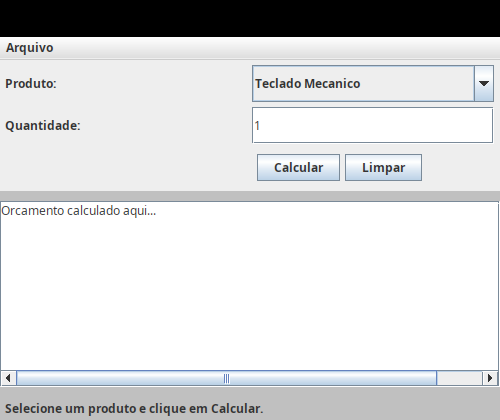
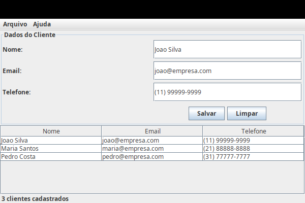

# Java Through the Ages — Museum of Historical Problems

> Este projeto nao mostra apenas como Java mudou. Mostra **por que** Java precisou mudar.

Cada modulo e uma "sala de museu" que representa uma era do Java, mas implementa um
**problema real** que a plataforma resolvia naquele periodo historico — nao uma repeticao
artificial do mesmo dominio funcional.

---

## Filosofia

A maioria dos tutoriais de Java ensina a sintaxe mais recente como se ela sempre
existisse. Este projeto faz o oposto: cada modulo e fiel as restricoes, ferramentas
e dores da sua epoca.

Nenhum codigo antigo e "ruim". Ele e o produto das ferramentas disponiveis, das
exigencias do mercado e do conhecimento acumulado ate aquele momento.

### Principios

- **Cada modulo resolve um problema diferente**, coerente com o contexto historico.
- **Cada modulo e autocontido** — sem dependencias entre modulos.
- **Tecnologias antigas sao usadas como eram na epoca** — sem modernizacao artificial.
- **A "dor" historica e explicita** — o que era dificil, frustrante ou limitado.
- **Sem Spring Boot em modulos antigos**, sem Docker nas eras pre-cloud.

---

## Linha do tempo

```
1995  1997  1999  2001  2003  2005  2007  2010  2014  2018  2021  2024
  |     |     |     |     |     |     |     |     |     |     |     |
 01-Applet/AWT
  |02-Swing Desktop
  |    03-RMI
  |          04-Servlet/JSP/JDBC
  |                05-EJB
  |                      06-Java ME
  |                            07-Spring XML
  |                                   08-Java 5
  |                                         09-Spring MVC REST
  |                                               10-Spring Boot
  |                                                     11-Cloud Native
  |                                                           12-Modern Java
```

---

## Capturas de tela

| Modulo | Era | Captura |
|--------|-----|---------|
| 01 | Applet/AWT (1995) |  |
| 02 | Swing Desktop (1998) |  |
| 03 | RMI (1997) | Terminal com RMI (sem GUI) |
| 04 | Servlet/JSP (1999) | Página web no Tomcat (sem GUI) |
| 08 | Java 5 (2004) |  |
| 10 | Spring Boot (2014) | Atuator HTTP (sem GUI) |

---

## Tabela de modulos

| # | Modulo | Era | Problema historico | Aplicacao | Tecnologias |
|---|--------|-----|-------------------|-----------|-------------|
| 01 | applet-awt-browser-era | 1995–1997 | Aplicacoes interativas no navegador antes de JS moderno | Catalogo de produtos com calculo de orcamento | Applet, AWT, JDK 1.0/1.1 |
| 02 | swing-desktop-backoffice | 1998–2002 | Aplicacoes desktop internas multiplataforma | Cadastro de clientes corporativo | Swing, JTable, serializacao, EDT |
| 03 | rmi-branch-office-distributed-system | 1997–2000 | Objetos distribuidos matriz/filial | Consulta e reserva de estoque remoto | RMI, rmiregistry, serializacao |
| 04 | servlet-jsp-jdbc-intranet | 1999–2003 | Migracao de apps internas para web | Sistema de chamados internos | Servlet, JSP, JDBC, Tomcat |
| 05 | ejb-enterprise-transaction-era | 2001–2005 | Transacoes, seguranca declarativa, componentes distribuidos | Transferencia bancaria transacional | EJB 2.x, JNDI, CMT, XML deployment |
| 06 | javame-field-service-mobile | 2003–2008 | Coleta de dados em celulares pre-smartphone | Vistoria tecnica offline | MIDP 2.0, CLDC, RecordStore |
| 07 | spring-xml-service-layer | 2004–2008 | Reacao a complexidade do EJB | Sistema de pedidos com camada de servico | Spring 2.x, DI, JdbcTemplate, XML |
| 08 | java5-generics-annotations-concurrency | 2004–2006 | Amadurecimento da linguagem | Processador de lote concorrente | Generics, enums, annotations, ExecutorService |
| 09 | spring-mvc-rest-json | 2008–2012 | APIs HTTP/JSON para integracao | API REST de catalogo de produtos | Spring MVC, Jackson, XML config |
| 10 | spring-boot-microservice | 2014–2017 | Microservicos, produtividade, deploy simplificado | Microservico de contas | Spring Boot, JPA, H2, Actuator |
| 11 | cloud-native-observability-era | 2018–2021 | Ambientes distribuidos em cloud/kubernetes | Processamento assincrono de pedidos | Spring Boot, logs estruturados, metrics, health |
| 12 | modern-java-language-evolution | 2021+ | Reducao de verbosidade, expressividade | Motor de regras com records e sealed classes | Java 17/21+, records, sealed, pattern matching |

---

## Como navegar

Siga a **ordem cronologica** (01 a 12) para perceber a evolucao como uma narrativa.
Cada modulo e independente, mas o efeito didatico e cumulativo.

Cada modulo contem:

- **Contexto historico**: o que acontecia no mundo e na tecnologia.
- **Problema resolvido**: qual dor de negocio a tecnologia atacava.
- **Tecnologias usadas**: com versoes especificas da epoca.
- **Limitacoes**: o que era frustrante ou impossivel.
- **Como executar**: instrucoes reais ou simuladas.
- **Peca de museu**: reflexao sobre o que o modulo representa.

---

## Documentacao complementar

| Documento | Descricao |
|-----------|-----------|
| [docs/timeline.md](docs/timeline.md) | Linha do tempo completa com marcos do Java |
| [docs/comparison-matrix.md](docs/comparison-matrix.md) | Matriz comparativa entre os 12 modulos |
| [docs/historical-problems.md](docs/historical-problems.md) | Os problemas que cada era resolveu |
| [docs/evolution-of-java-platform.md](docs/evolution-of-java-platform.md) | A evolucao da plataforma Java |
| [docs/from-applet-to-cloud-native.md](docs/from-applet-to-cloud-native.md) | A grande narrativa Applet → Cloud Native |

---

## Aviso ao estudante

**Codigo antigo nao e "codigo ruim".** E codigo que resolveu problemas reais
com as ferramentas disponiveis na epoca.

- Nao julgue Applets pela falta de generics — generics nao existiam.
- Nao critique EJB pelo XML excessivo — era o estado da arte em 2001.
- Nao estranhe a ausencia de lambdas em 2008 — Java 8 so chegaria em 2014.

Cada modulo e uma capsula do tempo. Aprenda com as limitacoes. Entenda por que
cada geracao seguinte surgiu para resolver as dores da anterior.

---

## Requisitos rapidos por modulo

| Modulo | JDK | Build | Deps externas | Screenshot |
|--------|-----|-------|---------------|------------|
| 01 | 8 | `./build.sh` | Nenhuma | [PNG](01-applet-awt-browser-era/docs/screenshot01.png) |
| 02 | 8+ | `./build.sh` | Nenhuma | [PNG](02-swing-desktop-backoffice/docs/screenshot02.png) |
| 03 | 8 | `./build.sh` | rmiregistry (ja inclui) | — |
| 04 | 8 | `./build.sh` | **Tomcat 8+** (instalar) | [HTML](04-servlet-jsp-jdbc-intranet/web/) |
| 05 | 8 | `./build.sh` | JBoss/WebLogic (ou simulador) | — |
| 06 | 8 | `./build.sh` | Nenhuma (emulator) | — |
| 07 | 8+ | `mvn compile exec:java` | Maven | — |
| 08 | 5+ | `./build.sh` | Nenhuma | [PNG](08-java5-generics-annotations-concurrency/docs/screenshot08.png) |
| 09 | 11+ | `mvn spring-boot:run` | Maven | — |
| 10 | 11+ | `mvn spring-boot:run` | Maven | — |
| 11 | 17+ | `mvn spring-boot:run` | Maven | — |
| 12 | 17+ | `./build.sh` | Nenhuma | — |

---

## Pre-requisitos globais

| Tecnologia | Modulos | Observacao |
|------------|---------|------------|
| JDK 8 | 01–06 | Suporte a Applets e rmic |
| JDK 8+ | 07–08 | Spring XML requer JDK 8 minimo |
| JDK 11+ | 09–11 | Spring 5.x requer JDK 8+, Spring Boot 2.x requer JDK 11+ |
| JDK 17+ | 12 | Records, sealed classes, pattern matching |
| Apache Tomcat 8+ | 04, 09 | Container servlet |
| Maven 3.6+ | 09–12 | Build moderno |
| Docker (opcional) | 11 | Ambiente cloud native simulado |

---

## Licenca

Uso educacional livre. Codigo didatico — sem garantias de producao.
